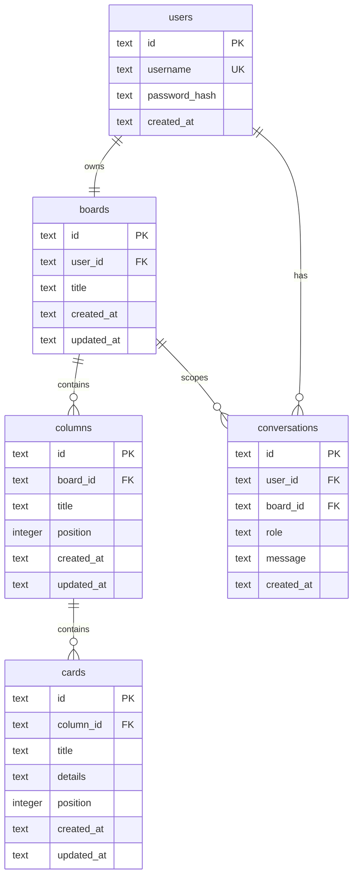

# Database Schema

## Overview

The MVP uses a local SQLite database. The schema supports multiple users for future work, while the app behavior remains one board per signed-in user for the MVP.

The database is relational rather than storing the board as one JSON blob. This keeps card moves, column renames, ordering, and future AI updates simple to validate and persist.

## Design Decisions

- Use SQLite with foreign keys enabled through `PRAGMA foreign_keys = ON`.
- Use text IDs generated by the application. Recommended format: short prefixed IDs such as `user_...`, `board_...`, `col_...`, `card_...`, `msg_...`.
- Keep exactly one board per user with `UNIQUE(user_id)` on `boards`.
- Keep columns fixed in count for the MVP, but allow column titles and positions to be persisted.
- Store card order with an integer `position` scoped to each column.
- Store conversation history by user and board so AI chat can include recent context.
- Use SQLAlchemy `create_all` or an explicit startup initializer for the MVP. Alembic can be added later when schema changes become frequent.
- Store `password_hash` for future multi-user support. The current MVP may seed the hardcoded `user` account and still validate `user` / `password` in the backend when Part 7 adds backend auth.

## Entity Relationship Diagram



## Tables

### users

Stores user identity. The MVP seeds one hardcoded user, but the schema supports additional users.

| Column | Type | Constraints | Notes |
| --- | --- | --- | --- |
| `id` | `TEXT` | Primary key | Application-generated ID |
| `username` | `TEXT` | Unique, not null | Login username |
| `password_hash` | `TEXT` | Not null | Future backend auth support |
| `created_at` | `TEXT` | Not null, default current timestamp | UTC timestamp |

### boards

Stores one Kanban board per user.

| Column | Type | Constraints | Notes |
| --- | --- | --- | --- |
| `id` | `TEXT` | Primary key | Application-generated ID |
| `user_id` | `TEXT` | Foreign key, unique, not null | One board per user |
| `title` | `TEXT` | Not null | Defaults to `My Board` |
| `created_at` | `TEXT` | Not null, default current timestamp | UTC timestamp |
| `updated_at` | `TEXT` | Not null, default current timestamp | Updated by app code |

### columns

Stores the fixed Kanban columns. The app can rename columns and persist their order.

| Column | Type | Constraints | Notes |
| --- | --- | --- | --- |
| `id` | `TEXT` | Primary key | Application-generated ID |
| `board_id` | `TEXT` | Foreign key, not null | Owning board |
| `title` | `TEXT` | Not null | User-editable |
| `position` | `INTEGER` | Not null | Order within board |
| `created_at` | `TEXT` | Not null, default current timestamp | UTC timestamp |
| `updated_at` | `TEXT` | Not null, default current timestamp | Updated by app code |

### cards

Stores Kanban cards and their position within a column.

| Column | Type | Constraints | Notes |
| --- | --- | --- | --- |
| `id` | `TEXT` | Primary key | Application-generated ID |
| `column_id` | `TEXT` | Foreign key, not null | Current column |
| `title` | `TEXT` | Not null | Required card title |
| `details` | `TEXT` | Not null | Empty string when omitted |
| `position` | `INTEGER` | Not null | Order within column |
| `created_at` | `TEXT` | Not null, default current timestamp | UTC timestamp |
| `updated_at` | `TEXT` | Not null, default current timestamp | Updated by app code |

### conversations

Stores AI chat history. Messages are scoped to both the user and board.

| Column | Type | Constraints | Notes |
| --- | --- | --- | --- |
| `id` | `TEXT` | Primary key | Application-generated ID |
| `user_id` | `TEXT` | Foreign key, not null | Message owner |
| `board_id` | `TEXT` | Foreign key, not null | Board context |
| `role` | `TEXT` | Not null, check `user` or `assistant` | Chat role |
| `message` | `TEXT` | Not null | Message content |
| `created_at` | `TEXT` | Not null, default current timestamp | Used for ordering |

## Constraints

- `boards.user_id` is unique to enforce one board per user.
- `columns(board_id, position)` is unique to prevent duplicate column order values within a board.
- `cards(column_id, position)` is unique to prevent duplicate card order values within a column.
- `conversations.role` is limited to `user` and `assistant`.
- Foreign keys use `ON DELETE CASCADE`, so deleting a user removes their board, columns, cards, and conversations.

## Indexes

- `idx_boards_user_id` supports lookup of a user's board.
- `idx_columns_board_id` supports loading board columns.
- `idx_cards_column_id` supports loading cards for each column.
- `idx_conversations_user_board_created_at` supports loading chat history in chronological order.

## DDL

The runnable DDL is stored in [schema.sql](schema.sql).

## Seed Data

Part 6 should create a default board for the hardcoded MVP user if it does not exist.

Recommended initial columns:

1. Backlog
2. Discovery
3. In Progress
4. Review
5. Done

## Board API Shape

The backend can return a board in the same general shape the frontend already uses:

```json
{
  "id": "board_default",
  "title": "My Board",
  "columns": [
    {
      "id": "col_backlog",
      "title": "Backlog",
      "position": 0,
      "cardIds": ["card_1"]
    }
  ],
  "cards": {
    "card_1": {
      "id": "card_1",
      "title": "Draft API contract",
      "details": "Define board and card routes.",
      "columnId": "col_backlog",
      "position": 0
    }
  }
}
```

This keeps Part 7 frontend integration small because the backend response can closely match the existing in-memory model.

